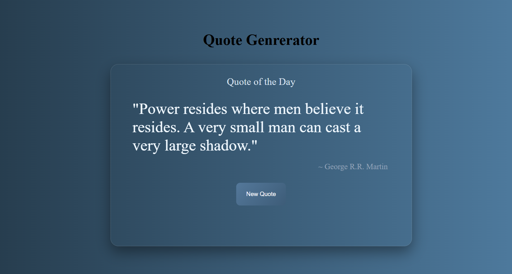

# 🌟 Random Quote Generator

A beautiful and responsive Random Quote Generator built using **HTML, CSS, and Vanilla JavaScript**. It fetches inspirational quotes dynamically from the API Ninjas Quotes API and displays a new quote every time the user clicks the **New Quote** button.

---

## 🚀 Features

- 🔄 Generate random quotes instantly
- 🌐 Fetch quotes from a live API
- 👤 Displays quote author
- ⏳ Loading message while fetching a new quote
- 🎨 Modern glassmorphism-inspired UI
- 📱 Responsive design
- ⚡ Built with asynchronous JavaScript (`async/await`)

---

## 🛠️ Tech Stack

- HTML5
- CSS3
- Vanilla JavaScript (ES6+)
- Fetch API
- API Ninjas Quotes API

---

## 📂 Project Structure

```
QUOTE_GENERATOR/
│
├── index.html
├── style.css
├── script.js
├── config.example.js
├── README.md
└── .gitignore
```

## 🔑 API Setup

1. Create an account on API Ninjas.
2. Generate your API key.
3. Create a `config.js` file in the root folder.
4. Add your API key:

```javascript
const API_KEY = "YOUR_API_KEY";
```

## ▶️ How to Run

- Clone the repository
- Create `config.js`
- Open `index.html` in the browser

## 📸 Preview




